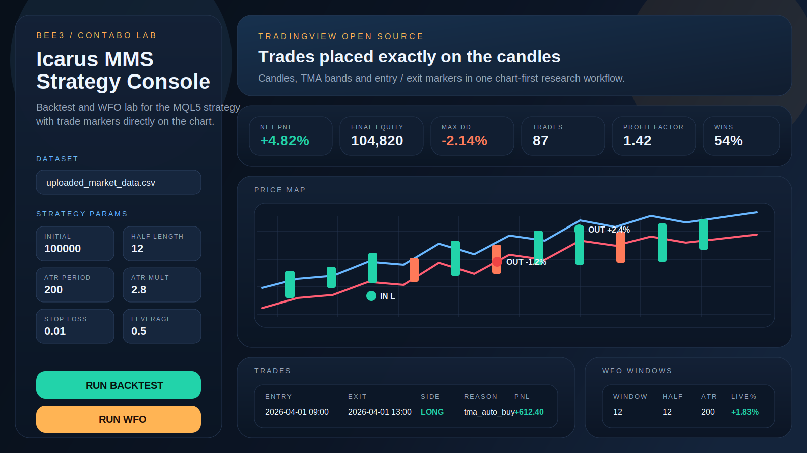

# Bee3 Icarus MMS Lab

Bee3 is a dedicated research dashboard for backtesting and walk-forward optimization
of the Icarus MMS trading logic recreated from:

- `FTMO_ICARUSMMS_MAIN.mq5`
- `tma_indikator.mq5`

The goal of this first stage is simple: reproduce the original mechanics as closely
as possible, inspect trade placement directly on the chart, and create a clean base
for later extensions such as RSI or Stoch RSI filters.

## Dashboard Preview



## What is included

- TMA band logic translated from the MQL5 indicator
- position sizing and capital management recreated from the EA
- Binance candle download from a selected symbol, interval and date range
- backtest mode for uploaded or downloaded OHLCV CSV files
- walk-forward optimization with configurable parameter grids
- run-time date filtering for backtest and WFO
- chart view with trade entry and exit markers using TradingView Lightweight Charts
- containerized deployment for local runs and Contabo hosting

## Stack

- FastAPI backend
- pandas + numpy simulation engine
- TradingView Lightweight Charts frontend
- Docker / docker compose deployment

## Project Layout

```text
bee3/
  bee3_dashboard.py
  bee3_engine.py
  bee3_wfo.py
  bee3_tma.py
  bee3_data.py
  static/
  data/
  results/
  docs/
```

## Quick Start

```bash
pip install -r requirements.txt
uvicorn bee3_dashboard:app --host 0.0.0.0 --port 8061
```

Open:

```text
http://127.0.0.1:8061
```

## Docker

```bash
docker compose up -d --build
```

The default dashboard port is:

```text
127.0.0.1:8061
```

## Input Data

CSV files should contain at least:

- `time`
- `open`
- `high`
- `low`
- `close`

Optional:

- `volume`

Supported time formats:

- ISO-8601
- Unix timestamp in seconds
- Unix timestamp in milliseconds

Example flow:

1. Start the app.
2. Download candles from Binance or upload your own CSV.
3. Select the test date range.
4. Run a backtest or WFO pass.
5. Inspect trade placement directly on the chart.

## Important Note About 1:1 Recreation

The engine reproduces the strategy rules and money management from the provided MQL files.
When only candle data is available, intrabar execution is simulated using a candle path:

- bullish candle: `open -> low -> high -> close`
- bearish candle: `open -> high -> low -> close`

That gives us a practical first testing layer on OHLC data without changing the strategy rules.
If tick data is added later, execution accuracy can be tightened further without redesigning the logic.

## Repository Policy

Sample market datasets are intentionally not stored in the repository anymore.
The `data/` directory is kept in place only as an upload target and local working folder.

## Current Status

This repository is the first operational lab version:

- strategy logic is in place
- dashboard is online-ready
- GitHub version is clean from sample data
- the next step can focus on additional decision filters and strategy refinement
